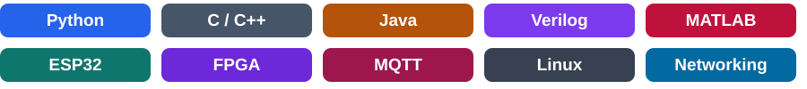

# 👋 Welcome! I’m Khalid

**Computer Engineering graduate from KFUPM · First Honors · Former Saudi Aramco PAN Engineering Intern**

I build projects across embedded systems, digital hardware, robotics, and software. My interests include industrial networking, connected devices, and turning engineering ideas into working systems.

[💼 LinkedIn](https://www.linkedin.com/in/khalid-alsaif-2818242a3) · [🚀 My repositories](https://github.com/khalid-alsaif?tab=repositories) · [🛠️ Featured projects](#-featured-engineering-projects)

---

## 🎓 Education

**B.S. in Computer Engineering — King Fahd University of Petroleum & Minerals (KFUPM)**  
August 2021 – May 2026 · Graduated with First Honors

My coursework covered computer networks and network design, embedded systems, digital logic and computer organization, operating systems, cloud and edge computing, Internet of Things, and computer and network security.

## 🏭 Industry experience

**Saudi Aramco — PAN Engineering Intern**  
June – August 2025

- Supported the maintenance and optimization of Plant Area Networks for industrial operations.
- Worked with engineers to diagnose connectivity issues and support operational teams.
- Developed software to automate gas-well assignment and scheduling, collaborating with three engineers to simplify tracking and assignment workflows.

## 🚀 Featured engineering projects

- ⚙️ **[AI-Driven Gearbox Fault Diagnostic Rig](https://github.com/khalid-alsaif/gearbox-fault-diagnostic-rig)** — Senior design work integrating a motor, variable-frequency drive, gearbox, brake, and vibration sensing for predictive maintenance. This repository contains the embedded data-acquisition and motor-control components; the PC classification application is outside its available scope.
- 🧮 **[FPGA Matrix Multiplier with HPS Interface](https://github.com/khalid-alsaif/fpga-matrix-multiplier)** — A DE1-SoC accelerator combining Verilog hardware, signed fixed-point arithmetic, asynchronous FIFOs, and C software for HPS control.
- 💻 **[Single-Cycle and Pipelined Processor](https://github.com/khalid-alsaif/pipelined-processor-logisim)** — 16-bit processor designs in Logisim, covering datapath, ALU, instruction control, forwarding, and hazard detection.
- 🤖 **[AI-Guided Maze-Navigating Car](https://github.com/khalid-alsaif/ai-maze-navigating-car)** — An ESP32 robotic car combining camera-based sign recognition with an Edge Impulse classifier and ultrasonic obstacle detection.
- 🎯 **[IoT Laser Tag](https://github.com/khalid-alsaif/iot-laser-tag)** — A two-player ESP32-S3 game using MicroPython, infrared sensing, MQTT events, and a Node-RED dashboard.
- 🌐 **[Enterprise Network Architecture Design — source archive](https://github.com/khalid-alsaif/khalid-alsaif/blob/main/enterprise-network-design.zip)** — Academic network-design work connecting my networking coursework with a practical enterprise architecture.

## 🧰 Technical background

| Area | Skills and foundations |
| --- | --- |
| Programming | Python, C/C++, Java, Assembly, Verilog, MATLAB |
| Embedded and digital systems | ESP32, Arduino, Mbed, FPGA development, digital logic, processor design |
| Networking | TCP/IP, IPv4/IPv6, subnetting, VLANs, routing and switching, network design |
| IoT and cloud | MQTT, CoAP, IoT architecture, Docker, virtualization, REST APIs, cloud and edge computing |
| Security fundamentals | Cryptography, access control, security protocols, data integrity |
| Tools | Linux, Wireshark, Cisco Packet Tracer, VS Code, GitHub, Quartus, Logisim |

## 📂 Project collection

<b>📚 Browse all 14 projects and their courses</b>

Each project is available through its repository or downloadable source archive.

| Project | Area | Course |
| --- | --- | --- |
| [AI-Driven Gearbox Fault Diagnostic Rig](https://github.com/khalid-alsaif/gearbox-fault-diagnostic-rig) | Arduino / ESP32 / vibration sensing | Senior Design |
| [AI-Guided Maze-Navigating Car](https://github.com/khalid-alsaif/ai-maze-navigating-car) | Arduino C++ / ESP32 / Edge Impulse / Freenove | COE450 |
| [FPGA Matrix Multiplier with HPS Interface](https://github.com/khalid-alsaif/fpga-matrix-multiplier) | Verilog / C / Intel Quartus / DE1-SoC | COE302 |
| [IoT Laser Tag](https://github.com/khalid-alsaif/iot-laser-tag) | MicroPython / ESP32-S3 / MQTT / Node-RED | COE454 |
| [Single-Cycle and Pipelined Processor](https://github.com/khalid-alsaif/pipelined-processor-logisim) | Logisim / digital logic / computer architecture | COE301 |
| [Obstacle Avoidance Car](https://github.com/khalid-alsaif/obstacle-avoidance-car) | C++ / Mbed / LPC1768 | COE306 |
| [FPGA Reaction Timer](https://github.com/khalid-alsaif/fpga-reaction-timer) | Verilog / Xilinx ISE | COE203 |
| [Java Dictionary and Data Structures](https://github.com/khalid-alsaif/java-dictionary-data-structures) | Java / AVL trees / binary search trees | ICS202 |
| [JavaFX Speed Click Game](https://github.com/khalid-alsaif/javafx-speed-click-game) | Java / JavaFX | ICS108 |
| [Sleep Health and Lifestyle Analysis — source archive](https://github.com/khalid-alsaif/khalid-alsaif/blob/main/sleep-health-data-analysis.zip) | Python / Jupyter / data analysis | ISE291 |
| [Spreadsheet Report Manager — source archive](https://github.com/khalid-alsaif/khalid-alsaif/blob/main/excel-report-manager.zip) | Python / Jupyter / openpyxl | ICS104 |
| [MATLAB Pulse Spectrum Analysis — source archive](https://github.com/khalid-alsaif/khalid-alsaif/blob/main/matlab-pulse-spectrum-analysis.zip) | MATLAB / signal processing | COE241 |
| [Smart Agricultural Monitoring and Control System — source archive](https://github.com/khalid-alsaif/khalid-alsaif/blob/main/smart-agriculture-system-design.zip) | Engineering design / project planning / smart agriculture | COE384 |
| [Enterprise Network Architecture Design — source archive](https://github.com/khalid-alsaif/khalid-alsaif/blob/main/enterprise-network-design.zip) | Computer networks / enterprise architecture | COE444 |

---

## 🤝 Leadership and languages

Led an 11-member team in the Quran Division of KFUPM's Al-Tawjih Al-Dini Club, organizing student programs and competitions. My volunteer experience also includes mentoring middle-school students as a summer-program supervisor.

**Languages:** Arabic (native) · English (professional)

Several projects were developed with teammates. Each repository describes its available files and project context.
